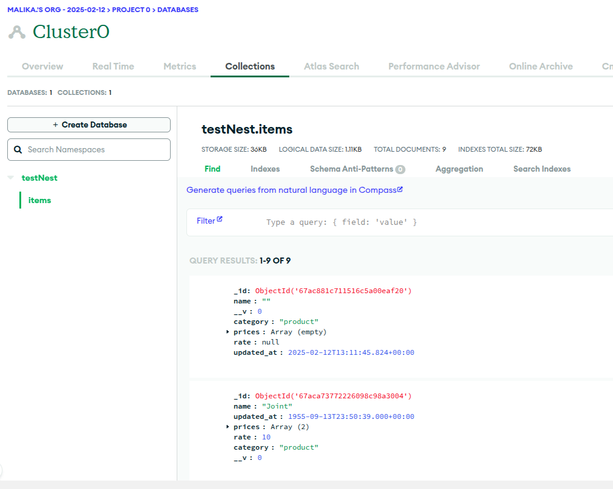

# Mini-project




Voici un fichier **README.md** clair et bien structuré pour ton projet. Il explique comment installer les dépendances et démarrer le backend et le frontend.  

---

### **README.md**
```markdown
# 🚀 Mon Projet Full-Stack (NestJS + Frontend)

Ce projet est une application full-stack avec **NestJS** pour le backend et un frontend (React, Angular ou autre).  

---

## 📂 Structure du Projet

```
/mon-projet
│── backend/      # Contient le backend (NestJS)
│── frontend/     # Contient le frontend (React, Angular, etc.)
│── README.md     # Documentation du projet
│── .gitignore    # Fichier pour ignorer node_modules
```

---

## 🛠️ Installation des Dépendances

### 🔹 Backend (NestJS)
1. Accéder au dossier **backend** :
   ```bash
   cd backend
   ```
2. Installer les dépendances :
   ```bash
   npm install
   ```

### 🔹 Frontend
1. Accéder au dossier **frontend** :
   ```bash
   cd frontend
   ```
2. Installer les dépendances :
   ```bash
   npm install
   ```

---

## 🚀 Démarrer l'Application

### ▶️ Lancer le Backend
Depuis le dossier **backend**, exécute :
```bash
npm run start
```
Ou en mode **développement** avec hot reload :
```bash
npm run start
```

### ▶️ Lancer le Frontend
Depuis le dossier **frontend**, exécute :
```bash
npm run start
```

L'application frontend sera accessible sur `http://localhost:3000` (ou autre port selon la config).

---

## 📝 Bonnes pratiques Git

1. **Ne pas inclure `node_modules`** dans Git :  
   Vérifie que `.gitignore` contient bien :
   ```
   node_modules/
   ```
   
2. **Si `node_modules` a été déjà ajouté** :
   ```bash
   git rm -r --cached node_modules
   git commit -m "Supprimer node_modules du dépôt"
   git push origin main
   ```

3. **Toujours installer les dépendances après un clone** :
   ```bash
   npm install
   ```

---

## ✅ Vérification

Après installation et démarrage, assure-toi que :
- Le backend fonctionne bien (`http://localhost:3000` pour NestJS).
- Le frontend est accessible (`http://localhost:4200` pour Angular ).

---

## 💡 Infos supplémentaires
- Backend : **NestJS + MongoDB**
- Frontend : **Angular**
- Base de données : **MongoDB**
- Gestion des erreurs MongoDB (Duplicate Key) corrigée

---

## 📌 Auteur
👤 ** WANNASI MALIKA **  
